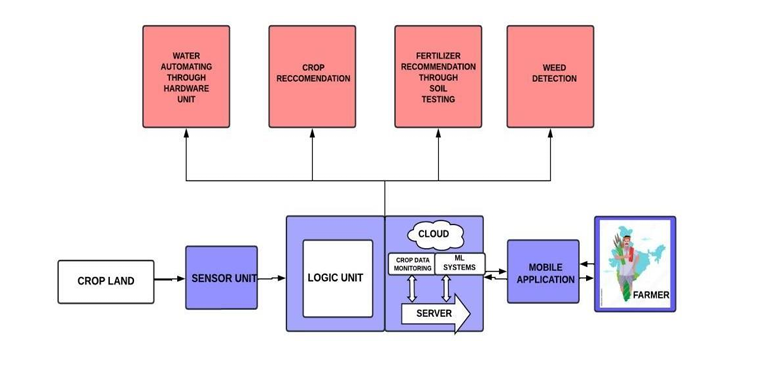
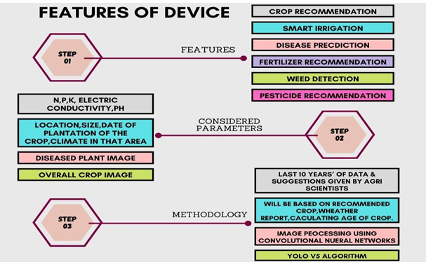
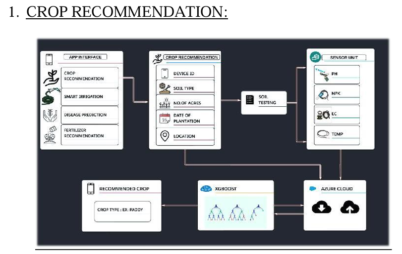
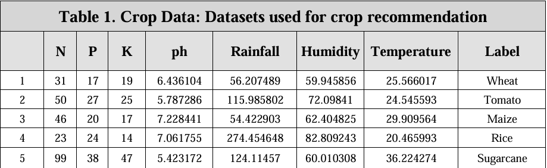
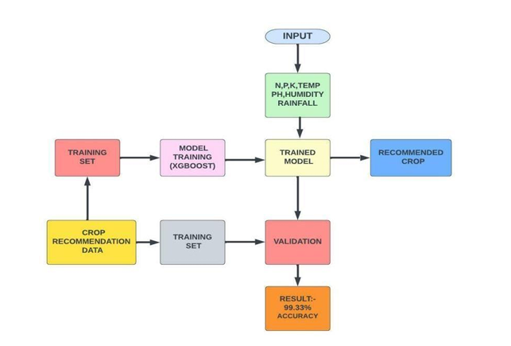
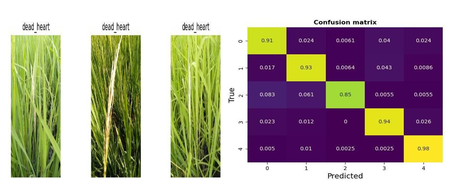
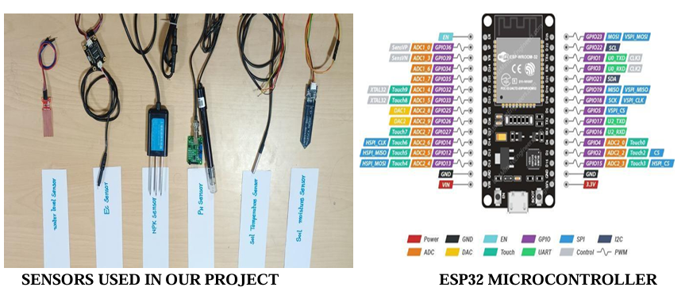

<h1 align="center">🌾 AGRI-WHEEL: Smart & Sustainable Agriculture System</h1>

  
  
  
  
  
  

---

## 📘 Abstract

Agriculture is the backbone of India’s economy, contributing significantly to the **GDP** and livelihood of millions. With rising population and limited farmland, achieving **higher yield in less area** has become a challenge.

**AGRI-WHEEL** is an innovative **IoT + Machine Learning-based Smart Agriculture System** that addresses these challenges. It leverages **Azure Cloud**, **WSNs (Wireless Sensor Networks)**, and **ML algorithms** to create a **real-time precision farming ecosystem**.

This system performs **soil testing**, **crop recommendation**, **disease prediction**, **weed detection**, and **smart irrigation control**, ensuring efficient resource usage and improved yield.

---

## 🌾 Objectives

- 📊 **Crop Recommendation** using XGBoost  
- 🌿 **Disease Prediction** using CNN  
- 🌱 **Weed Detection** using YOLOv5  
- 💧 **Smart Irrigation** with automatic inlet/outlet control  
- 🧪 **Fertilizer Recommendation** with brand details  
- ☀️ **Solar-powered operation** for sustainability  

---

## 🧠 Index Terms

`Azure Cloud`, `IoT`, `Sensors`, `Smart Agriculture`,  
`Sustainable Farming`, `Smart Irrigation`, `YOLOv5`,  
`Android App`, `CNN`, `XGBoost`, `Fertilizer Suggestion`

---

## 🚀 Overall Innovation

AGRI-WHEEL combines **hardware, cloud, and mobile application** layers into one cohesive system.

- **Hardware:** Collects real-time soil and environmental data using sensors (NPK, pH, EC, temperature, humidity, water level).  
- **Cloud (Azure):** Stores and processes data, running ML models for predictions.  
- **Mobile App:** Displays data, predictions, and irrigation control options to farmers.

🔋 Powered by **solar energy**, the model ensures sustainability even in remote locations.

---

## 🌟 Key Features

✅ Real-time crop and soil monitoring  
✅ AI-powered recommendations  
✅ Cloud-based data storage and analytics  
✅ Voice commands for local language support  
✅ Android-based monitoring and control  
✅ Solar and battery-based self-sustainability  

---

## 🧩 Block Diagram

---

## ⚙️ System Workflow

### 🔹 Stage 1 – Data Collection
Sensors gather **NPK**, **pH**, **EC**, **moisture**, **humidity**, and **temperature** values.  
The system’s camera captures field images periodically and sends them to the cloud.

### 🔹 Stage 2 – Data Processing
The **Azure Cloud** compares real-time data with predefined thresholds.  
- XGBoost → Crop Recommendation  
- CNN → Disease Detection  
- YOLOv5 → Weed Detection  

### 🔹 Stage 3 – Decision & Control
- Controls irrigation (INLET/OUTLET motors) automatically.  
- Displays results and alerts on the mobile app.  
- Provides voice-based feedback in the farmer’s local language.  

---

## 🧰 Hardware Components

| Component | Description |
|------------|-------------|
| **NodeMCU / Arduino** | Core microcontroller |
| **NPK Sensor** | Nutrient level detection |
| **pH & EC Sensors** | Soil property monitoring |
| **DHT11/DHT22** | Temperature and humidity |
| **Moisture Sensor** | Soil moisture detection |
| **Water Level Sensor** | Irrigation tank level |
| **Camera Module** | Crop image capture |
| **Relay & Motors** | Automated water flow control |
| **Solar Battery** | Renewable power source |

---

## ☁️ Azure Cloud Integration

| Azure Service | Purpose |
|----------------|----------|
| **IoT Hub** | Data communication between devices |
| **Azure ML Studio** | Model training & deployment |
| **Blob Storage** | Image and data storage |
| **Stream Analytics** | Real-time analysis |
| **Power BI** | Data visualization |

---

## 🧮 Machine Learning Models

| Function | Algorithm | Purpose |
|-----------|------------|----------|
| 🌾 Crop Recommendation | XGBoost | Suggests optimal crops |
| 🌿 Disease Detection | CNN | Identifies plant diseases |
| 🌱 Weed Detection | YOLOv5 | Detects and classifies weeds |
| 🧪 Fertilizer Suggestion | Rule-Based | Provides brand & usage details |

---

## 📸 Visual Overview

### 🧱 Features Overview

### 🌾 Crop Recommendation

### 📊 Dataset

### 🧠 Model Summary

### 🌿 Prediction Result

### 🧩 Sensors Setup

### 💡 Overall Innovation

---

## 📱 Android Application

**App Functions:**
- Monitor live sensor data 🌡️  
- Receive crop & fertilizer suggestions 🌾  
- Control irrigation remotely 💧  
- Upload plant images for disease analysis 🌿  
- Receive voice alerts in regional language 🗣️  

---

## 📊 Advantages

| Feature | Benefit |
|----------|----------|
| 💧 Smart Irrigation | Saves water efficiently |
| 🌾 Crop Recommendation | Increases yield |
| 🧪 Fertilizer Control | Reduces chemical overuse |
| ☀️ Solar-Powered | Sustainable energy use |
| 🧠 ML Integration | Data-driven decision-making |
| 🗣️ Voice Interface | Ease of use for farmers |

---

## 🔋 Power Management

Powered by **solar renewable energy**, the system operates continuously even in low-resource environments.  
Backup **rechargeable batteries** ensure uninterrupted operation during cloudy conditions.

---

## 🚧 Future Enhancements

- Drone-based field image collection  
- Blockchain for supply-chain transparency  
- Multi-crop prediction system  
- Advanced weather forecasting integration  
- AI chatbot for farmer interaction  

---

## 👨‍💻 Author

**👤 Nageswararao Potla**  
💡 *IoT, Cloud, and AI Enthusiast | Smart Agriculture Innovator*  

📫 Contact: *(nageswararaopotla2003@gmail.com)*  

---

## 🪴 Conclusion

**AGRI-WHEEL** represents a step toward **data-driven, sustainable, and automated agriculture**.  
By merging **IoT, Cloud, and ML technologies**, it empowers farmers to **increase productivity**, **reduce waste**, and **achieve sustainable growth**.

> 🌍 “Empowering Farmers through Technology for a Smarter, Greener Tomorrow.”

---

## 📜 License

Licensed under the **MIT License** — free to use for research and education.

---

  
  

